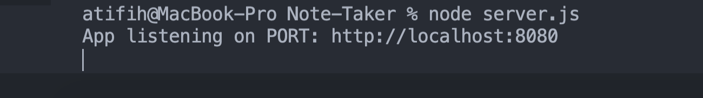
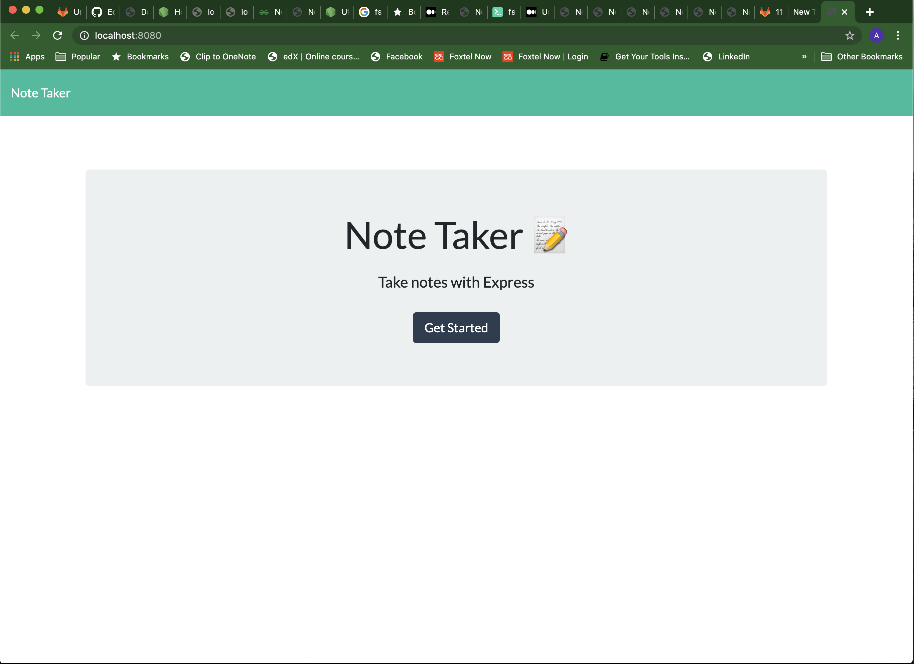
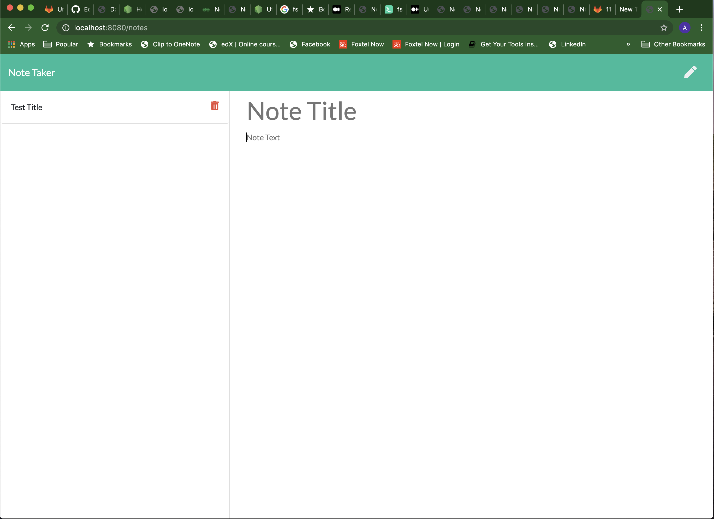
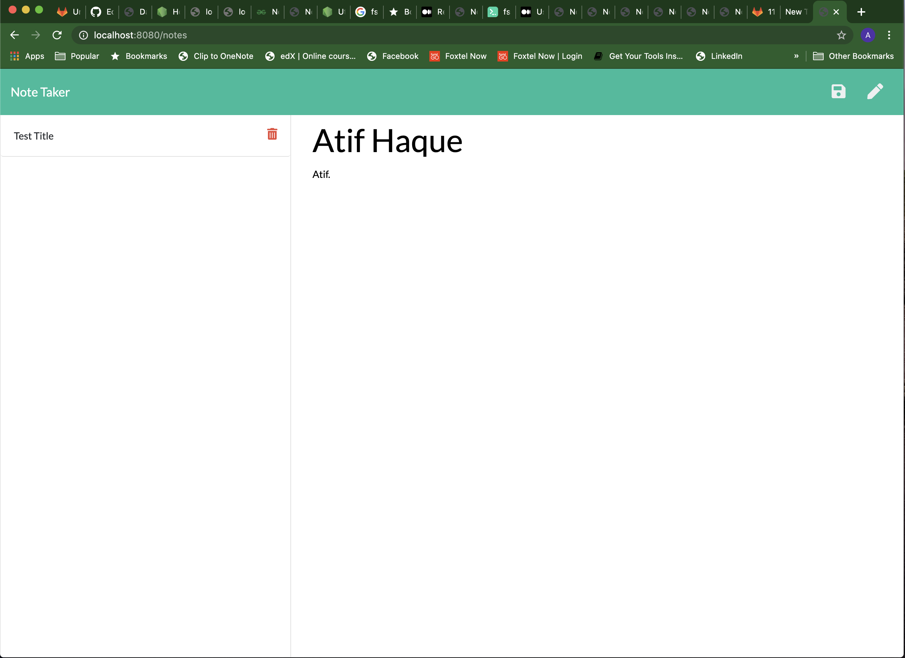
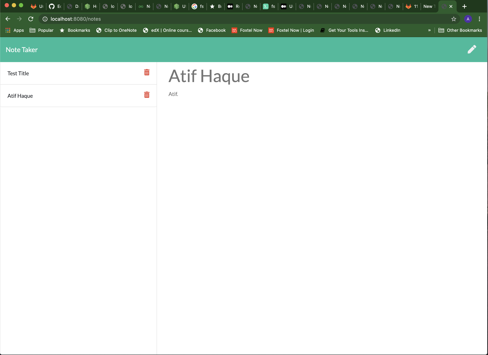

# Note-Taker
An application that can be used to write, save and delete notes. This application uses an Express 'backend' and is capable of saving and retrieving note data from a JSON file.

## Table of Contents
  * [Description](#description)
  * [Installing Dependencies](#installing-dependencies)
  * [Usage](#usage)
  * [License](#license)
  * [Contributing](#contributing)
  * [Tests](#tests)
  * [Questions](#questions)

## Description
An application that can be used to write, save and delete notes. This application uses an Express 'backend' and is capable of saving and retrieving note data from a JSON file.

The application may be invoked from the command line like so:
**node server.js**

## Installing Dependencies
 Dependencies maybe installed as follows:
 **npm i**

## Usage
  

Here, the application is started from te CLI as depicted  here. The application will advise the user that the server has started and is listening at a specific port for client requests.

The end-user will then be greeting to a 'Get Started' page.

The end-user proceeds with this application by clicking  the 'get started' button to officially 'enter the app', where notes can be created, saved & deleted from the database.

The end-user is presented with the screen shown here where they will create a note which will then be  subsequently saved it once  the 'save icon' is clicked (from the left hand pane).

The created note is saved and displayed  as shown here.

For note deletion, the end-user can select a saved note from the left hand pane and click the 'delete icon'.

The list of currently  saved notes is re-displayed in the application window.

After deleting all notes, the user is presented with the 'original/home page' as illustrated here.

## License
MIT.
 
## Contributing
All pull requests are allowed/encouraged. For developers looking to make profound changes to this project, kindly open an issue detailing any proposed changes to be made so that a discussion may ensue.
 .
## Tests
Currently there are no  tests provided within the repository, this  is subject to change as more thorough or formal testing of this app ensues sometime in the future.

## Questions
[Developer GitHub profile link](https://github.com/atifih)  
[Developer Email link](mailto:atif.haque@gmail.com)  
[Link to Deployment](https://secret-hamlet-01481.herokuapp.com/)

